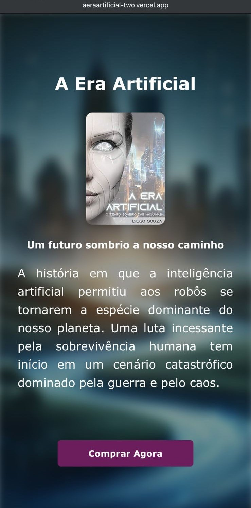

# 📘 A Era Artificial - Landing Page

Landing page fictícia criada para promover o livro de ficção científica **"A Era Artificial"**, que explora um futuro sombrio dominado por inteligência artificial e robôs.

## 💡 Sobre o Projeto

Este projeto tem como objetivo demonstrar habilidades em desenvolvimento front-end, com foco em design responsivo, estrutura semântica e boas práticas de HTML5 e CSS3.

A página apresenta informações sobre o livro, detalhes do autor, e um botão de compra redirecionando para a Amazon.

## 🛠️ Tecnologias Utilizadas

- HTML5
- CSS3
- Font Awesome (ícones)
- Responsividade com Media Queries

## 🎨 Principais Recursos

- Design moderno e responsivo
- Efeito de desfoque no plano de fundo (blur)
- Seções bem organizadas: introdução, detalhes do livro, sobre o autor e chamada para ação
- Ícones de redes sociais com hover interativo
- Adaptado para telas pequenas e médias (mobile e tablet)

## 📱 Layout Responsivo

A página se adapta automaticamente a diferentes tamanhos de tela:

- ✅ Telas grandes (desktop)
- ✅ Tablets (até 768px)
- ✅ Smartphones (até 425px)

## 📷 Capturas de Tela

### Versão Desktop

### Versão Mobile

## 🔗 Link de Acesso

Se você quiser ver o projeto funcionando, pode abrir o arquivo `index.html` no seu navegador ou hospedá-lo no GitHub Pages.

---

## 👨‍💻 Autor

**Alexandre Costa**

- 💼 [LinkedIn](https://www.linkedin.com/in/alexandre-costa085/)
- 🧑‍💻 [GitHub](https://github.com/alexandrecosta085)

---

## 📄 Licença

Este projeto é fictício, criado apenas para fins educacionais e de portfólio.  
Nenhuma informação comercial ou conteúdo real foi utilizado com fins lucrativos.

---
